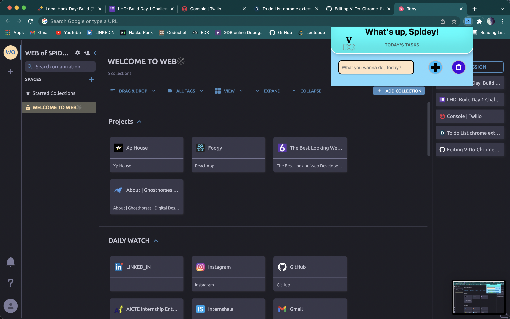
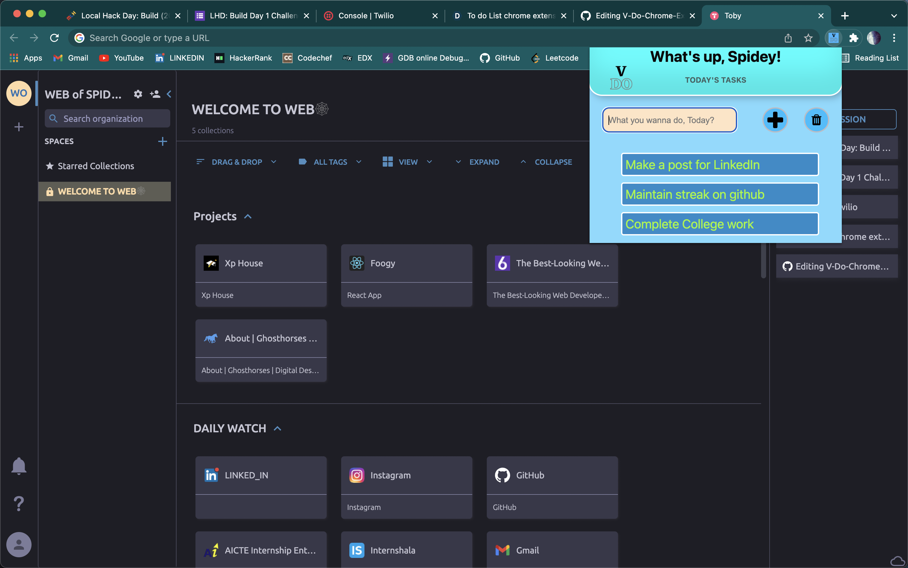

# V-Do-Chrome-Extension🚀

It's a simple to-do list chrome extension to manage your tasks.🏆

# How to use it?🤔

1.  Download the source Code and save it on your local machine.
2. Open Google Chrome Browser and go to settings.
3. Go to extensions and activate developer mode on chrome (at top right corner).
4. Now click on Load unpacked on left side of the window! 
5. Search and select the directory where you downloaded the code!

# Technologies used😄
1. Html5
2. Css3
3. Javascript
4. Json

# Sample Screenshots 👀

# Leave a star if you like!
